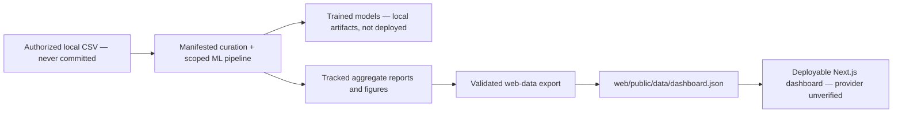

# SecureSwipe — Fraud Detection & Risk Analytics

SecureSwipe is an end-to-end machine-learning portfolio project for detecting
fraudulent credit-card transactions in an extremely imbalanced dataset. It
combines data validation, leakage-safe preprocessing, baseline models, XGBoost,
validation-only model and threshold selection, SHAP explainability, and one
locked held-out test evaluation with a deployment-safe Next.js dashboard.

## Live Demo

The repository does not record an independently verified live URL. The
deployable static frontend root is `web/`; no public deployment is performed by
the checked-in workflows.

The deployable frontend uses **static evaluation artifacts and precomputed
demonstration interactions**. It does not perform live transaction inference.

## Architecture



Training, large-data processing, cross-validation, threshold sweeps, final
evaluation, and SHAP generation stay offline. `scripts/export_web_data.py`
validates the tracked outputs against each other, rejects non-finite JSON,
copies approved figures, and produces the small public payload used by the web
application. No raw rows, fitted preprocessors, or model binaries are shipped.

The complete development, historical-lock, bundle/API, monitoring, public-data,
and trust-boundary diagram is in [`docs/ARCHITECTURE.md`](docs/ARCHITECTURE.md).

## Why This Problem Is Hard

Fraud is rare. In this dataset, only 492 out of 284,807 transactions are fraud:

| Item | Value |
|---|---:|
| Total transactions | 284,807 |
| Fraud cases | 492 |
| Legitimate transactions | 284,315 |
| Fraud rate | 0.1727% |
| Imbalance ratio | 577.88:1 |

Accuracy is misleading here. A model can predict every transaction as legitimate
and still score above 99% accuracy while catching zero fraud. This project
therefore prioritizes average precision, recall, precision, F1-score, ROC-AUC, and
confusion matrix analysis.

## Dataset

The project uses the Kaggle Credit Card Fraud Detection dataset. The `V1` to
`V28` fields are anonymized PCA-transformed features, with `Time`, `Amount`,
and `Class` as additional columns. The raw `creditcard.csv` file is not meant
to be committed; place it in `data/raw/creditcard.csv`.

That exact 284,807-row/492-fraud corpus is already test-observed and is therefore
reference-only: restoring or renaming it does not make it eligible for new model
decisions. New selection and bundle evidence requires a separately sourced,
authorized development dataset under the same contract.

## Technology

- Python, pandas, NumPy
- scikit-learn
- XGBoost
- SHAP
- matplotlib
- pytest
- joblib, pyarrow
- Next.js 16, React 19, TypeScript, Tailwind CSS, Recharts
- Vercel-compatible static dashboard configuration (not deployed or verified here)

## Project Structure

```text
src/data/              data loading, validation, and split helpers
src/preprocessing/     leakage-safe preprocessing pipeline
src/models/            baseline and XGBoost model utilities
src/evaluation/        metrics, comparison, threshold tuning, final evaluation
src/explainability/    SHAP explainability helpers
src/artifacts/         versioned bundle creation and verified loading
src/inference/         canonical batch/risk scoring shared by API and monitoring
src/monitoring/        offline schema, feature, score, and delayed-label diagnostics
api/                   versioned FastAPI reference service
scripts/               reproducible day-by-day pipeline runners
tests/                 unit, contract, integration, determinism, and failure tests
reports/               generated Markdown reports and metrics
artifacts/models/      trained model artifacts
scripts/export_web_data.py  deterministic tracked-artifact export
web/                    Next.js dashboard and public aggregate artifacts
```

## Local Toolchain Setup

```bash
python3 -m venv .venv
source .venv/bin/activate
python3 -m pip install --require-hashes -r requirements/quality.lock
cd web
nvm install 22.13.1
nvm use 22.13.1
test "$(node --version)" = "v22.13.1"
npm ci
npx playwright install --no-shell chromium
cd ..
```

The default lock is the Apple Silicon/Darwin CPU closure. Linux CI and the
container use the separately resolved `quality-linux.lock` and `api-linux.lock`
closures with CPU-only XGBoost; neither Linux lock contains NVIDIA packages.

The full ML pipeline requires the Kaggle dataset at:

```text
data/raw/creditcard.csv
```

## Reproduce the Historical Reference Stages

Direct Day 2–7 CLIs are disabled because they wrote partial, unmanifested files
into shared directories. Use the atomic stage wrapper. Each target must be new;
completed runs include hashes, code/runtime provenance, parameters, and seeds.
These stages reproduce the legacy random-split workflow for reference only and
must not be used for new model or threshold decisions.

```bash
python3 scripts/run_reference_stage.py --stage day2 --skip-figures \
  --output-dir artifacts/runs/reference-day2
python3 scripts/curate_dataset.py \
  --source data/raw/creditcard.csv \
  --source-kind historical_kaggle_reference \
  --source-reference kaggle-creditcard-historical-reference \
  --output-dir artifacts/runs/historical-curated
python3 scripts/run_reference_stage.py --stage day3 \
  --data-path artifacts/runs/historical-curated/curated.csv \
  --output-dir artifacts/runs/reference-day3
python3 scripts/run_reference_stage.py --stage day4 \
  --processed-dir artifacts/runs/reference-day3/data/processed \
  --output-dir artifacts/runs/reference-day4
python3 scripts/run_reference_stage.py --stage day5 \
  --processed-dir artifacts/runs/reference-day3/data/processed \
  --day4-metrics-path artifacts/runs/reference-day4/reports/metrics/day4_baseline_metrics.json \
  --output-dir artifacts/runs/reference-day5
python3 scripts/run_reference_stage.py --stage day6 \
  --processed-dir artifacts/runs/reference-day3/data/processed \
  --model-path artifacts/runs/reference-day5/artifacts/models/xgboost_baseline.joblib \
  --output-dir artifacts/runs/reference-day6
python3 scripts/run_reference_stage.py --stage day7 \
  --processed-dir artifacts/runs/reference-day3/data/processed \
  --model-path artifacts/runs/reference-day5/artifacts/models/xgboost_baseline.joblib \
  --output-dir artifacts/runs/reference-day7
python3 scripts/verify_historical_observation.py
python3 -m scripts.run_project_audit --allow-missing-model --check
```

That data-free/current-state audit passes its executable checks but reports the
serving bundle as unavailable. The strict release audit is intentionally
separate: configure `SECURESWIPE_BUNDLE_MANIFEST` to a reviewed real bundle and
run `python3 -m scripts.run_project_audit` without `--allow-missing-model`.
The audit expects the exact Node/browser setup above; it fails rather than
silently accepting an unsupported ambient Node runtime.

Run tests:

```bash
python3 -m compileall src scripts tests
python3 -m pytest
```

The model and preprocessor files written under `artifacts/` remain local and are
ignored by Git. Ordinary web updates do not require running these training
commands again.

## New Development-to-Bundle Workflow

Use only a genuinely new, authorized dataset—not the already-observed Kaggle
corpus. The curation step preserves raw input, rejects conflicting-label
duplicates, deterministically keeps the first exact feature vector, and records
raw/curated hashes plus removed class counts. Because bytes cannot prove where
data came from, new data also requires a separately reviewed source approval
bound to the exact CSV checksum and required attestation; this is an explicit
human trust boundary, not cryptographic proof that no historical row was copied.
The training command uses four chronological roles, applies an uncertainty-aware
simplicity rule, fits calibration, selects a threshold, runs a reusable forward
development backtest, and atomically emits a verified bundle plus service parity.

```bash
python3 scripts/curate_dataset.py \
  --source /path/to/new-authorized-development.csv \
  --source-kind new_authorized_development \
  --source-reference owner-approved-source-version \
  --source-approval /path/to/reviewed-source-approval.json \
  --output-dir artifacts/development/curated-v1
python3 scripts/run_development_training.py \
  --curated-data artifacts/development/curated-v1/curated.csv \
  --curation-record artifacts/development/curated-v1/curation.json \
  --historical-quarantine artifacts/historical-test-quarantine-v1/manifest.json \
  --output-dir artifacts/development/run-v1
```

The approval contract and exact attestation text are in
[`docs/SOURCE_APPROVAL.md`](docs/SOURCE_APPROVAL.md). Project-created historical
derivatives carry `historical_taint` and cannot be promoted when their lineage
record is present. A detached/copied CSV is inherently indistinguishable by
content alone and therefore still requires a reviewer to attest its origin.

For configurable post-training cost-scenario diagnostics of that verified run:

```bash
python3 scripts/run_development_analysis.py \
  --scores artifacts/development/run-v1/development_scores.csv \
  --curated-data artifacts/development/curated-v1/curated.csv \
  --curation-record artifacts/development/curated-v1/curation.json \
  --training-run-manifest artifacts/development/run-v1/run_manifest.json \
  --cost-scenarios configs/cost_scenarios.example.yaml \
  --output-dir artifacts/development/cost-analysis-v1
```

## Refresh Deployment Artifacts

After the tracked reports change, rebuild the public dashboard payload without
training or inference:

```bash
python3 scripts/export_web_data.py
python3 scripts/export_web_data.py --check
```

The exporter reads:

- `reports/day2_eda_summary.md`
- `reports/day3_preprocessing_summary.md`
- `reports/model_comparison/validation_model_comparison.json`
- `reports/threshold_tuning/threshold_metrics.csv`
- `reports/threshold_tuning/selected_thresholds.json`
- `reports/final/final_model_evaluation.json`
- `reports/explainability/shap_top_features.json`

It writes `web/public/data/dashboard.json` and synchronizes only the approved
aggregate figures used by the frontend. The command is deterministic so stale
exports can be detected in CI.

## Next.js Dashboard

The dashboard presents class imbalance, validation model comparison, the full
threshold sweep, final test metrics and confusion matrix, validation PR/ROC
curves, SHAP feature importance, methodology, limitations, and artifact
provenance. The decision control is explicitly hypothetical and does not claim
to score a transaction.

Run locally:

```bash
cd web
npm ci
npm run dev
```

Open:

```text
http://localhost:3000
```

Production checks:

```bash
npm run data:check
npm run lint
npm run typecheck
npm run test
npm run build
npx playwright install --no-shell chromium
npm run test:e2e
```

Node.js 22.13.1 is pinned by `web/.nvmrc` and selected through `web/package.json`.
Use the exact setup commands above before the aggregate audit. The lockfile is committed
and must remain authoritative. The production Chromium gate verifies keyboard
and mobile behavior, WCAG A/AA rules, and that the static dashboard emits no
`/v1/predict` request.

## Modeling Summary

Day 4 trained Dummy, Logistic Regression, and Random Forest baselines. Day 5
added XGBoost and selected the champion model by validation average precision.

| Model | Validation average precision | Validation ROC-AUC |
|---|---:|---:|
| XGBoost | 0.8129 | 0.9851 |
| Random Forest | 0.8125 | 0.9309 |
| Logistic Regression | 0.6275 | 0.9684 |
| Dummy baseline | 0.0017 | 0.5000 |

Champion model: `xgboost_baseline`.

## Threshold Tuning

The champion model was tuned on validation data only. The test set was not used
for threshold selection.

| Threshold | Precision | Recall | F1 | Use |
|---:|---:|---:|---:|---|
| 0.50 | 0.6061 | 0.8108 | 0.6936 | Default |
| 0.98 | 0.9138 | 0.7162 | 0.8030 | Best validation F1 |
| 0.53 | 0.6250 | 0.8108 | 0.7059 | Historical development operating point |

Historical development operating point: `0.53`, selected as the highest-precision
threshold whose observed validation recall met the configured 0.80 point
constraint. It is not a business-policy or future-performance guarantee.

## Explainability

The tracked Day 7 ranking came from a validation sample, but its row identities,
labels, score composition, output unit, and additivity residual were not retained;
without the absent model artifact it is historical, unit-unverified evidence.
New runs explain XGBoost raw margin/log-odds, verify SHAP additivity against the
native margin, and emit aggregate fraud/high-score/representative cohort evidence.
SHAP remains noncausal and is never used for tuning or feature selection. PCA
components cannot be mapped to real merchant or customer attributes.

Generated outputs:

- `reports/explainability/shap_feature_importance.csv`
- `reports/explainability/shap_top_features.json`
- `reports/explainability/shap_cohort_evidence.json` (new verified runs only)
- `reports/explainability/shap_summary_report.md`
- `reports/figures/shap_summary_bar.png`
- `reports/figures/shap_top_features.png`

## Final Evaluation

The repository records one evaluation of the selected XGBoost model and
threshold `0.53` on the random held-out test split. That result is now an
immutable historical observation: `scripts/verify_historical_observation.py`
checks its hashes, while `scripts/run_final_evaluation.py` refuses to load test
data or run it again. Test results are not used for further development choices.

Final evaluation outputs:

- `reports/final/final_model_evaluation.json`
- `reports/final/final_evaluation_report.md`
- `reports/final/final_project_report.md`
- `reports/final/project_audit_checklist.md`

## Training, Evaluation, Export, and Deployable Static Behavior

| Stage | Where it runs | Uses private rows | Runs on web request |
|---|---|---:|---:|
| Data validation and preprocessing | Local Python environment | Yes | No |
| Model training and selection | Local Python environment | Yes | No |
| Threshold sweep and SHAP | Local Python environment | Yes | No |
| Locked final test evaluation | Local Python environment | Yes | No |
| Web export | Local/CI, from aggregate reports | No | No |
| Deployable static dashboard | Candidate provider/visitor browser | No | Yes, static rendering only |

The deployable frontend therefore uses **precomputed inference summaries, sanitized
aggregate evaluation artifacts, and demonstration controls**—not live model
inference.

## Environment Variables

The current static dashboard requires **no environment variables**. The root
`.env.example` records that contract. Do not add transaction data, Vercel
tokens, model paths, or secrets to frontend variables. Any future secret must
stay server-side and must never use a `NEXT_PUBLIC_` prefix.

## Vercel Deployment

The repository contains `web/vercel.json`, but no provider action is authorized
or verified. Provider pricing/limits, preview isolation, current CLI steps, and
rollback behavior must be checked after local container gates pass. Deployment,
repository connection, and environment changes require explicit owner approval.
See [`docs/DEPLOYMENT.md`](docs/DEPLOYMENT.md).

## Publication Workflow (Not Executed)

1. Regenerate or update tracked Python reports locally.
2. Run `python3 scripts/export_web_data.py`.
3. Run the Python and frontend test commands above.
4. Review `git diff` and commit the report/export/frontend changes locally.
5. Immediately before any push, preview, merge, or production deployment, obtain
   the required explicit approval and verify the provider's current workflow.

Do not run model training during `next build`, Vercel deployment, browser page
loads, or API requests.

## Security and Privacy

- The original Kaggle CSV, processed splits, joblib models, preprocessors,
  caches, `.env*`, `.vercel/`, and local build outputs are ignored.
- The dashboard has no upload endpoint, database, authentication secret, or
  transaction persistence.
- It renders only repository-controlled JSON and text; there is no user HTML
  injection path.
- Response headers disable framing, MIME sniffing, sensitive browser features,
  and broad external content sources.
- Aggregate artifacts are checked for internal consistency and strict JSON
  safety before deployment.
- The application does not claim PCI DSS, regulatory, bank-grade, or production
  financial certification.

## Limitations and Disclaimer

- The dataset is anonymized and historical, so feature interpretation is limited.
- SHAP explains transformed PCA features, not original business fields.
- No trained model artifact or inference service is included in the static frontend.
- XGBoost scores have not been calibrated as real-world fraud probabilities.
- No live feedback loop or domain-approved fraud-loss/review-cost estimate is
  available. Offline monitoring exists for authorized local batches, but no real
  monitoring baseline or automatic action is claimed.

SecureSwipe is an educational portfolio fraud-analytics system. It is not a
bank's production authorization system and must not be used to approve, block,
or investigate real transactions.

## Future Work

- Execute the existing cost-sensitivity engine only after a domain owner supplies
  reviewed real business assumptions.
- Execute the implemented monitoring/calibration protocols on authorized
  development data and establish reviewed reference windows.
- Pass Docker startup/readiness/inference, image scan, and SBOM gates before any
  optional synthetic live-demo integration.

Detailed limitations/non-goals and interview/demo guides are in
[`docs/LIMITATIONS.md`](docs/LIMITATIONS.md),
[`docs/INTERVIEW_DEFENSE.md`](docs/INTERVIEW_DEFENSE.md), and
[`docs/DEMO.md`](docs/DEMO.md).

## Author

Mayank Suryavanshi
