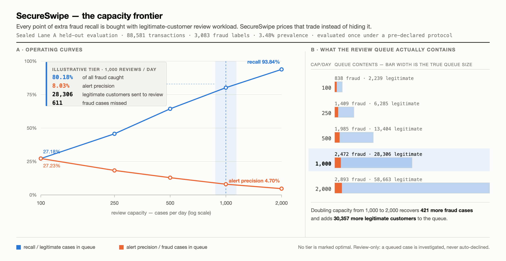

<div align="center">

# 🛡️ SECURESWIPE

---

### A capacity-aware fraud-risk manager for human review

*Razorpay AI Buildathon 2026 · Track 02 — AI Risk Manager*

[](https://github.com/imayankss/SecureSwipe/actions/workflows/quality.yml)


**[Live dashboard](https://secure-swipe.vercel.app/)** ·
**[Demo](https://secure-swipe.vercel.app/demo)** ·
**[Evidence](https://secure-swipe.vercel.app/evidence)** ·
**[Methodology](https://secure-swipe.vercel.app/secureswipe-methodology.html)** ·
**[Architecture](docs/ARCHITECTURE.md)** ·
**[Quick start](#quick-start)**

</div>

---

<p align="justify">
SecureSwipe ranks suspicious card transactions under a fixed review budget, exposes the
legitimate-customer workload created by every operating point, and produces bounded, auditable
decisions <b>without autonomously blocking payments</b>.
</p>

> **Defense-only.** SecureSwipe supports a risk analyst. It does not authorize, approve, capture,
> block, or decline a payment. Every outcome is either `human_review` or `below_review_threshold`.

---

## The proof in 30 seconds

| Result | Verified value |
| --- | ---: |
| Average precision (AP) | **0.208660** |
| Recall at 1,000 reviews/day | **80.18%** |
| Alert precision at that tier | **8.03%** |
| Evaluation population | **88,581 transactions / 3,083 fraud labels** |

<p align="justify">
These numbers are unflattering on purpose. An 8.03% alert precision means about eleven legitimate
customers are reviewed for every fraud caught — and SecureSwipe reports that cost in the headline
rather than burying it behind an accuracy figure, because a model that predicts "legitimate" for
every row in this population would score 96.52% accuracy while catching zero fraud.
</p>

> Sealed **Lane A** held-out evaluation on public IEEE-CIS research data, run exactly once under a
> pre-declared protocol. Offline ranking evidence — not live Razorpay performance, and not a serving claim.
> Full record: [Lane A final evaluation](docs/evidence/LANE_A_FINAL_EVALUATION.md).

---

## The core trade-off, measured

<picture>
  <source media="(prefers-color-scheme: dark)" srcset="docs/assets/capacity-frontier-dark.png">
  
</picture>

<p align="justify">
<b>Figure 1 — The capacity frontier.</b> Recall and alert precision are two ends of the same rope.
Past roughly 500 reviews a day, every additional point of recall is paid for with a queue that is
overwhelmingly legitimate traffic: doubling capacity from 1,000 to 2,000 recovers 421 more fraud
cases and adds 30,357 more legitimate customers to the queue. No tier is marked optimal, because
optimality depends on costs the evaluation does not contain. Every count is drawn from the
<a href="docs/evidence/LANE_A_FINAL_EVALUATION.md#5--capacity-results">frozen Lane A capacity frontier</a>
and sums to the sealed population of 88,581 in every row.
</p>

---

## How SecureSwipe works

```
score  →  rank under capacity  →  route  →  explain  →  audit  →  replay / fail closed
```

| Step | What happens | Guarantee |
| --- | --- | --- |
| **1 · Score** | A checksum-verified local bundle normalizes fields into its recorded order and runs the estimator | Deterministic · **zero LLM tokens** |
| **2 · Rank under capacity** | Transactions are ordered by score and the top-*B* are selected for a fixed daily budget *B* | Workload is chosen, not discovered |
| **3 · Route** | Each case becomes `human_review` or `below_review_threshold` | Never an approve, block, or decline |
| **4 · Explain** | Score meaning, calibration status, and threshold come from bundle provenance | No browser-side assumptions |
| **5 · Audit** | A successful decision receives a chained, allowlisted, tamper-evident receipt | No raw body, PAN, CVV, or credentials stored |
| **6 · Replay / fail closed** | An identical request replays the original response and receipt without re-scoring; a missing, corrupt, or invalid path returns no decision | Idempotent · fails closed |

<p align="justify">
The three reviewer surfaces are deliberately different: <code>/</code> is the concise product narrative,
<code>/evidence</code> is the detailed scientific record, and <code>/demo</code> is an opt-in local
reference walkthrough. The static routes perform no live inference.
</p>

---

## Evidence boundaries

<p align="justify">
Every claim in this repository is filed against exactly one evidence category, and each category
carries an explicit ceiling. This table is the shortest honest summary of what SecureSwipe has and
has not proven.
</p>

| Evidence | Proves | Does **not** prove |
| --- | --- | --- |
| **Sealed Lane A** | Held-out ranking performance and capacity counts | Live serving parity |
| **Reference demo** | Bounded execution, audit, and replay mechanics | Lane A inference |
| **Cost explorer** | Sensitivity under user-entered assumptions | Real savings, ROI, or merchant economics |
| **Load evidence** | Tested local behavior | Razorpay-scale throughput |

> The exact Lane A serving chain is unavailable and cryptographically unproven; neither the local API
> nor `/demo` claims to serve the headline model. The final P1-S4 scale matrix
> [failed closed](docs/benchmarks/P1_S4_TERMINAL_CLOSEOUT_EVIDENCE.md), so no multi-worker
> scalability or production-capacity claim is made.

---

## Demo and graceful failure

The deterministic walkthrough at `/demo` proves six things in order, and is designed to be as
convincing when it refuses as when it succeeds:

| # | Step | Observable result |
| --- | --- | --- |
| 1 | Readiness probe | Model provenance and bundle checksum reported before any decision |
| 2 | Bounded decision | One fixed synthetic fixture returns `human_review` or `below_review_threshold` |
| 3 | Audit receipt | A genuine chained hash is appended and shown |
| 4 | Idempotent replay | The same request ID returns the same response with **no duplicate event** |
| 5 | Invalid request | A malformed fixture is rejected `422` with **no decision** |
| 6 | Missing bundle | Without a verified bundle the system **fails closed** and says so |

---

## Quick start

**Install** — CPython 3.12.10, Node.js 22.13.1. Raw datasets and trained bundles are intentionally absent.

```bash
python3 -m venv .venv && .venv/bin/python -m pip install --require-hashes -r requirements/quality.lock
cd web && npm ci && cd ..
```

**Run the reviewer dashboard** — open `http://127.0.0.1:3000/`, `/evidence`, `/demo`.

```bash
cd web && npm run build && npm run start -- --hostname 127.0.0.1 --port 3000
```

**Run the deterministic local demo** — generates a synthetic bundle in a temp directory outside the repo.

```bash
demo_root=$(mktemp -d) && .venv/bin/python scripts/create_synthetic_bundle.py --output "$demo_root/bundle" && mkdir "$demo_root/audit" && SECURESWIPE_ARTIFACT_ROOT="$demo_root" SECURESWIPE_BUNDLE_MANIFEST="$demo_root/bundle/manifest.json" SECURESWIPE_AUDIT_LOG="$demo_root/audit/prediction-events.ndjson" SECURESWIPE_CORS_ORIGINS="http://127.0.0.1:3000" .venv/bin/uvicorn api.main:app --host 127.0.0.1 --port 8000
```

**Verify the evidence** — checks aggregates and locks; it does not rerun the sealed evaluation.

```bash
.venv/bin/python -m pytest && .venv/bin/python scripts/export_web_data.py --check && .venv/bin/python scripts/verify_historical_observation.py
```

Full environment variants, cleanup, and CI gates: [Reproducibility](docs/REPRODUCIBILITY.md).

**Intake modes stay separate.** The quarantined historical reference corpus, a new authorized
corpus, and the repository audit are never the same command — this separation is enforced by a test,
not just documented.

```bash
.venv/bin/python scripts/curate_dataset.py --source-kind historical_kaggle_reference   # quarantined reference only
.venv/bin/python scripts/curate_dataset.py --source-kind new_authorized_development    # a new approved corpus
.venv/bin/python scripts/run_development_training.py                                   # then train on it
```

For a data-free repository check, run `python3 -m scripts.run_project_audit --allow-missing-model --check`.
For a model-required audit, run `python3 -m scripts.run_project_audit` without `--allow-missing-model`.

---

## Architecture and evidence

| Read next | Purpose |
| --- | --- |
| [Architecture](docs/ARCHITECTURE.md) | Components, data flow, state profiles, and trust boundaries |
| [Architecture gallery](docs/architecture/README.md) | Seven diagrams of the verified boundaries — what each one proves, and what it deliberately does not |
| [Methodology (live)](https://secure-swipe.vercel.app/secureswipe-methodology.html) | The full evaluation argument, figures, and cost model in one page |
| [Evidence guide](docs/EVIDENCE_GUIDE.md) | Evidence categories and the one-minute reviewer path |
| [Claim-to-evidence matrix](docs/evidence/CLAIM_TO_EVIDENCE_MATRIX.md) | Admissible wording and the exact proof behind each claim |
| [Model card](docs/MODEL_CARD.md) | Intended use, inputs, outputs, and model/evidence separation |
| [Scientific validity](docs/SCIENTIFIC_VALIDITY.md) | Selection, evaluation, and leakage controls |
| [API guide](docs/API.md) · [Deployment](docs/DEPLOYMENT.md) | V1/V2 contracts, readiness, audit, replay, and source-integrity procedure |
| [Threat model](docs/THREAT_MODEL.md) · [Limitations](docs/LIMITATIONS.md) | The full security and non-goal boundary |

---

## Limitations

<p align="justify">
Lane A is one offline evaluation on public IEEE-CIS research data — not Razorpay, Indian-payment, or
live-merchant performance — and it was programmatically held out, not human-blind or externally blind.
The local reference bundle is <b>not</b> proven to be the sealed Lane A model. Illustrative workload
and cost inputs omit real staffing, queues, delayed labels, and merchant economics. Authentication,
TLS termination, high availability, and a verified public backend are not established. SHAP is
noncausal, and fairness cannot be evaluated without protected attributes and an authorized study design.
</p>

The complete boundary is maintained in [Limitations and non-goals](docs/LIMITATIONS.md).

---

<div align="center">

Created by **Mayank Suryavanshi** · Licensed under the [MIT License](LICENSE)

[Contributing](CONTRIBUTING.md) · [Security policy](SECURITY.md)

</div>
