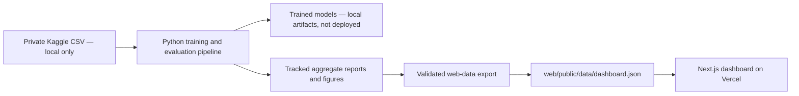

# SecureSwipe — Fraud Detection & Risk Analytics

SecureSwipe is an end-to-end machine-learning portfolio project for detecting
fraudulent credit-card transactions in an extremely imbalanced dataset. It
combines data validation, leakage-safe preprocessing, baseline models, XGBoost,
validation-only model and threshold selection, SHAP explainability, and one
locked held-out test evaluation with a deployment-safe Next.js dashboard.

## Live Demo

The production URL will be added here immediately after the Vercel production
deployment is created and independently verified. The deployable frontend root
is `web/`.

The hosted application uses **static evaluation artifacts and precomputed
demonstration interactions**. It does not perform live transaction inference.

## Architecture



Training, large-data processing, cross-validation, threshold sweeps, final
evaluation, and SHAP generation stay offline. `scripts/export_web_data.py`
validates the tracked outputs against each other, rejects non-finite JSON,
copies approved figures, and produces the small public payload used by the web
application. No raw rows, fitted preprocessors, or model binaries are shipped.

## Why This Problem Is Hard

Fraud is rare. In this dataset, only 492 out of 284,807 transactions are fraud:

| Item | Value |
|---|---:|
| Total transactions | 284,807 |
| Fraud cases | 492 |
| Legitimate transactions | 284,315 |
| Fraud rate | 0.1727% |
| Imbalance ratio | 577.88:1 |

Accuracy is misleading here. A model can predict every transaction as legitimate
and still score above 99% accuracy while catching zero fraud. This project
therefore prioritizes PR-AUC, recall, precision, F1-score, ROC-AUC, and
confusion matrix analysis.

## Dataset

The project uses the Kaggle Credit Card Fraud Detection dataset. The `V1` to
`V28` fields are anonymized PCA-transformed features, with `Time`, `Amount`,
and `Class` as additional columns. The raw `creditcard.csv` file is not meant
to be committed; place it in `data/raw/creditcard.csv`.

## Technology

- Python, pandas, NumPy
- scikit-learn
- XGBoost
- SHAP
- matplotlib
- pytest
- joblib, pyarrow
- Next.js 16, React 19, TypeScript, Tailwind CSS, Recharts
- Vercel for the static dashboard deployment

## Project Structure

```text
src/data/              data loading, validation, and split helpers
src/preprocessing/     leakage-safe preprocessing pipeline
src/models/            baseline and XGBoost model utilities
src/evaluation/        metrics, comparison, threshold tuning, final evaluation
src/explainability/    SHAP explainability helpers
scripts/               reproducible day-by-day pipeline runners
tests/                 lightweight synthetic unit tests
reports/               generated Markdown reports and metrics
artifacts/models/      trained model artifacts
scripts/export_web_data.py  verified deployment export
web/                    Next.js dashboard and public aggregate artifacts
```

## Local Python Setup

```bash
python3 -m venv .venv
source .venv/bin/activate
python3 -m pip install -r requirements.txt
```

The full ML pipeline requires the Kaggle dataset at:

```text
data/raw/creditcard.csv
```

## Reproduce the ML Pipeline

```bash
python3 scripts/run_day2_eda.py
python3 scripts/run_day3_preprocessing.py
python3 scripts/run_day4_baseline_models.py
python3 -m scripts.run_day5_advanced_models
python3 -m scripts.run_day6_threshold_tuning
python3 -m scripts.run_day7_explainability
python3 -m scripts.run_final_evaluation
python3 -m scripts.run_project_audit
```

Run tests:

```bash
python3 -m compileall src scripts tests
python3 -m pytest
```

The model and preprocessor files written under `artifacts/` remain local and are
ignored by Git. Ordinary web updates do not require running these training
commands again.

## Refresh Deployment Artifacts

After the verified reports change, rebuild the public dashboard payload without
training or inference:

```bash
python3 scripts/export_web_data.py
python3 scripts/export_web_data.py --check
```

The exporter reads:

- `reports/day2_eda_summary.md`
- `reports/day3_preprocessing_summary.md`
- `reports/model_comparison/validation_model_comparison.json`
- `reports/threshold_tuning/threshold_metrics.csv`
- `reports/threshold_tuning/selected_thresholds.json`
- `reports/final/final_model_evaluation.json`
- `reports/explainability/shap_top_features.json`

It writes `web/public/data/dashboard.json` and synchronizes only the verified
aggregate figures used by the frontend. The command is deterministic so stale
exports can be detected in CI.

## Next.js Dashboard

The dashboard presents class imbalance, validation model comparison, the full
threshold sweep, final test metrics and confusion matrix, validation PR/ROC
curves, SHAP feature importance, methodology, limitations, and artifact
provenance. The decision control is explicitly hypothetical and does not claim
to score a transaction.

Run locally:

```bash
cd web
npm ci
npm run dev
```

Open:

```text
http://localhost:3000
```

Production checks:

```bash
npm run data:check
npm run lint
npm run typecheck
npm run test
npm run build
```

Node.js 22 is selected through `web/package.json`. The lockfile is committed and
must remain authoritative.

## Modeling Summary

Day 4 trained Dummy, Logistic Regression, and Random Forest baselines. Day 5
added XGBoost and selected the champion model by validation PR-AUC.

| Model | Validation PR-AUC | Validation ROC-AUC |
|---|---:|---:|
| XGBoost | 0.8129 | 0.9851 |
| Random Forest | 0.8125 | 0.9309 |
| Logistic Regression | 0.6275 | 0.9684 |
| Dummy baseline | 0.0017 | 0.5000 |

Champion model: `xgboost_baseline`.

## Threshold Tuning

The champion model was tuned on validation data only. The test set was not used
for threshold selection.

| Threshold | Precision | Recall | F1 | Use |
|---:|---:|---:|---:|---|
| 0.50 | 0.6061 | 0.8108 | 0.6936 | Default |
| 0.98 | 0.9138 | 0.7162 | 0.8030 | Best validation F1 |
| 0.53 | 0.6250 | 0.8108 | 0.7059 | Recommended business threshold |

Recommended operating threshold: `0.53`, selected as the highest-precision
threshold with validation recall at least 0.80.

## Explainability

Day 7 uses SHAP on a small validation sample to explain the already-trained
XGBoost model. SHAP is used only for explanation, not tuning, feature selection,
or model changes. Because most features are PCA-anonymized, the explanations
describe model behavior over transformed components rather than real-world
merchant or customer attributes.

Generated outputs:

- `reports/explainability/shap_feature_importance.csv`
- `reports/explainability/shap_top_features.json`
- `reports/explainability/shap_summary_report.md`
- `reports/figures/shap_summary_bar.png`
- `reports/figures/shap_top_features.png`

## Final Evaluation

The final evaluation uses the locked XGBoost model and locked threshold `0.53`
on the held-out test split once. No threshold tuning, model selection,
preprocessing changes, or feature changes are performed using test results.

Final evaluation outputs:

- `reports/final/final_model_evaluation.json`
- `reports/final/final_evaluation_report.md`
- `reports/final/final_project_report.md`
- `reports/final/project_audit_checklist.md`

## Training, Evaluation, Export, and Hosted Behavior

| Stage | Where it runs | Uses private rows | Runs on web request |
|---|---|---:|---:|
| Data validation and preprocessing | Local Python environment | Yes | No |
| Model training and selection | Local Python environment | Yes | No |
| Threshold sweep and SHAP | Local Python environment | Yes | No |
| Locked final test evaluation | Local Python environment | Yes | No |
| Web export | Local/CI, from aggregate reports | No | No |
| Hosted dashboard | Vercel/visitor browser | No | Yes, static rendering only |

The hosted project therefore uses **precomputed inference summaries, sanitized
aggregate evaluation artifacts, and demonstration controls**—not live model
inference.

## Environment Variables

The current static dashboard requires **no environment variables**. The root
`.env.example` records that contract. Do not add transaction data, Vercel
tokens, model paths, or secrets to frontend variables. Any future secret must
stay server-side and must never use a `NEXT_PUBLIC_` prefix.

## Vercel Deployment

Create a dedicated Vercel project for this repository and set its Root Directory
to `web`. From `web/`, the current CLI workflow is:

```bash
vercel link
vercel deploy --logs
vercel curl / --deployment <preview-url>
vercel logs --deployment <preview-url> --level error
vercel deploy --prod
```

The framework should be detected as Next.js, the install command should use the
committed npm lockfile, and the build command should be `npm run build`. No
output-directory override is required. Connecting the GitHub repository lets
future branches create previews and updates to the configured production branch
create production deployments.

## Updating the Live Application

1. Regenerate or update verified Python reports locally.
2. Run `python3 scripts/export_web_data.py`.
3. Run the Python and frontend test commands above.
4. Review `git diff`, commit the report/export/frontend changes, and push a
   non-production branch for a Vercel preview.
5. Merge through the repository's normal review process when the preview is
   accepted; the connected Vercel project will deploy the configured production
   branch.

Do not run model training during `next build`, Vercel deployment, browser page
loads, or API requests.

## Security and Privacy

- The original Kaggle CSV, processed splits, joblib models, preprocessors,
  caches, `.env*`, `.vercel/`, and local build outputs are ignored.
- The dashboard has no upload endpoint, database, authentication secret, or
  transaction persistence.
- It renders only repository-controlled JSON and text; there is no user HTML
  injection path.
- Response headers disable framing, MIME sniffing, sensitive browser features,
  and broad external content sources.
- Aggregate artifacts are checked for internal consistency and strict JSON
  safety before deployment.
- The application does not claim PCI DSS, regulatory, bank-grade, or production
  financial certification.

## Limitations and Disclaimer

- The dataset is anonymized and historical, so feature interpretation is limited.
- SHAP explains transformed PCA features, not original business fields.
- No trained model artifact or inference service is included in the hosted site.
- XGBoost scores have not been calibrated as real-world fraud probabilities.
- No live feedback loop, drift monitoring, fraud-loss model, or review-cost
  estimate is available.

SecureSwipe is an educational portfolio fraud-analytics system. It is not a
bank's production authorization system and must not be used to approve, block,
or investigate real transactions.

## Future Work

- Add cost-sensitive threshold optimization with real business costs.
- Add monitoring for class drift and calibration drift.
- Add model calibration analysis.
- Package inference behind a separately secured service only after the full
  preprocessor/model artifact set, input contract, monitoring, and production
  requirements have been validated.

## Author

Mayank Suryavanshi
