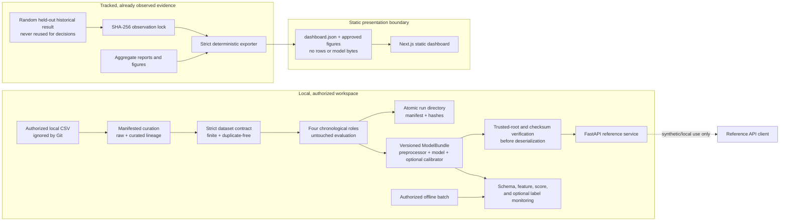

# Architecture and data flow

SecureSwipe is a portfolio reference with four deliberately separate paths:
offline model development, immutable historical evidence, verified local
serving, and a static public dashboard. It is not a bank authorization system.

## Component ownership

| Concern | Canonical implementation | Evidence/failure boundary |
|---|---|---|
| Dataset curation and lineage | `src/data/curation.py` and `scripts/curate_dataset.py` | Conflicting labels fail; stable exact-duplicate removal records raw/curated fingerprints and decision eligibility |
| Dataset schema and fingerprint | `src/data/data_loader.py` | Rejects wrong order/type, missing/non-finite values, negative Time/Amount, invalid Class, and unresolved exact duplicates |
| Split isolation | `src/data/split_data.py` | Pairwise row-hash intersections must be empty |
| Feature preprocessing | `src/preprocessing/preprocessors.py` | Fits scaling only on training rows and preserves the canonical 30-feature order |
| New scientific decisions | `scripts/run_development_training.py` and `scripts/run_development_analysis.py` | New authorized data only; four content-hash-isolated roles; atomic bundle and untouched evaluation |
| Historical observation | `src/evaluation/historical_lock.py` | Verify-only three-file SHA-256 lock; no evaluation execution path |
| Artifact persistence | `src/artifacts/bundle.py` | Trusted local root, complete manifest, sizes, hashes, runtime/dependency/schema/type checks before load |
| Batch scoring | `src/inference/batch_scoring.py` | One ordered, finite scoring path shared by serving and monitoring |
| HTTP interface | `api/` | Versioned schemas, bounded body/batch, stable errors, readiness, redacted logs, bounded metrics |
| Offline monitoring | `src/monitoring/` and `scripts/run_offline_monitoring.py` | Invalid batches are reported but never scored; drift triggers investigation, not automatic action |
| Public export | `scripts/export_web_data.py` | Cross-artifact invariants and read-only `--check`; no private/model input |
| Browser presentation | `web/` | Static-only by default; browser test fails on `/v1/predict` traffic |

## Evidence namespaces

The names are part of the scientific control, not presentation labels:

- `historical_reported_test` is the one already-observed random holdout. Its
  confusion-derived values are internally consistent, but the original score
  vector/runtime is absent and duplicate contamination cannot be measured.
- `new_authorized_three_way_development` packages a model trained on the first
  chronological role, calibration fit/selection evidence, and one untouched
  development evaluation; content fingerprints enforce isolation.
- forward/blocked development evidence estimates temporal sensitivity by keeping
  equal timestamps together and refitting inside each fold.
- `legacy_random_*_reference` exists only to reproduce the old stage structure;
  it is explicitly ineligible for new decisions.

## Artifact and API trust boundary

Joblib/pickle integrity checks do not make arbitrary serialized objects safe.
The service accepts neither artifact uploads nor paths from requests. An operator
selects a locally produced manifest inside the configured artifact root. Bundle
bytes, schema, payload types, dependency/runtime versions, and checksums are
validated before deserialization. A missing bundle leaves liveness available but
readiness and inference unavailable; an explicitly configured invalid bundle
aborts startup.

Inference endpoints offload synchronous model work from the event loop, while a
lock serializes estimator access because arbitrary fitted estimators are not
assumed thread-safe. Request logs contain request metadata and model version, not
feature vectors or downstream exception messages.

## Deployment shape

The checked-in deployable units are a static Next.js frontend and a separately
containerized FastAPI service. The image contains no data, model, reports,
notebooks, frontend, tests, or credentials; a reviewed bundle is mounted
read-only. There is no verified public backend or repository-recorded frontend
URL. Provider selection, authentication, TLS/rate-limit ownership, public
deployment, and DNS remain external decisions requiring explicit approval.

See [THREAT_MODEL.md](THREAT_MODEL.md), [CONTAINER.md](CONTAINER.md), and
[OPERATIONS.md](OPERATIONS.md) for security and recovery boundaries.
