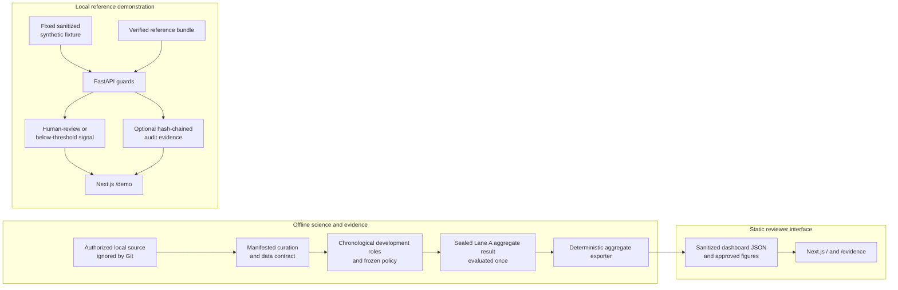

# Architecture

This is the canonical description of SecureSwipe's current implemented system
shape. Deployment procedure belongs in [DEPLOYMENT.md](DEPLOYMENT.md), operating
limits belong in [LIMITATIONS.md](LIMITATIONS.md), and claim admissibility belongs
in the [evidence guide](EVIDENCE_GUIDE.md).

SecureSwipe is a portfolio fraud-risk reference with three primary paths:
offline evidence production, static reviewer presentation, and local verified
serving. They share contracts and provenance, but they do not share a model
artifact or evidence claim by implication.

## System overview



## Component ownership

| Concern | Canonical implementation | Boundary |
| --- | --- | --- |
| Data curation and lineage | `src/data/curation.py`, `scripts/curate_dataset.py` | Exact source approval and content fingerprints; raw data stays local |
| Dataset schema | `src/data/data_loader.py` | Ordered numeric contract, finite values, duplicate handling |
| Partition isolation | `src/data/split_data.py`, Lane A contracts | Content-hash-disjoint roles and frozen final access |
| Preprocessing and model development | `src/preprocessing/`, `src/models/`, `scripts/run_development_training.py` | Training-only fitting and recorded development provenance |
| Sealed Lane A evaluation | `src/lane_a/`, `scripts/lane_a_run_final_evaluation.py` | One authorized final lifecycle; public output is aggregate only |
| Bundle persistence | `src/artifacts/bundle.py` | Trusted root, manifest, types, runtime metadata, and payload checksums |
| Canonical scoring | `src/inference/batch_scoring.py` | Ordered feature normalization shared by direct and API paths |
| HTTP service | `api/main.py`, `api/schemas.py`, `api/service.py` | Versioned requests, bounded errors, readiness, admission, timeout, redaction |
| Audit and idempotency | `api/audit.py` | In-process replay and optional local tamper-evident NDJSON |
| Static export | `scripts/export_web_data.py` | Cross-artifact invariants; aggregate evidence only |
| Reviewer UI | `web/app/`, `web/components/` | Static `/` and `/evidence`, optional local API interaction on `/demo` |
| Offline monitoring | `src/monitoring/`, `scripts/run_offline_monitoring.py` | Diagnostics only; no automatic model or policy change |
| Optional local durability | `src/operations/durable_idempotency.py` | SQLite prototype, non-default, outside the API request path |
| Synthetic order integrity | `src/order_integrity/` | Separate pre-model reference; not wired into fraud scoring |

## Offline evidence path

Authorized development sources are curated into a strict schema with recorded
lineage and content-derived identities. Development roles isolate model fitting,
calibration fitting, operating-point selection, and reusable forward analysis.
Lane A then applies a separately frozen final protocol and publishes only safe
aggregate counts, intervals, tables, and digests.

The final role is closed after its one authorized evaluation. Its output feeds
the deterministic exporter; it does not feed the local API. The detailed
scientific lifecycle is recorded in
[LANE_A_FINAL_EVALUATION.md](evidence/LANE_A_FINAL_EVALUATION.md) and the
[execution ledger](evidence/EXECUTION_LEDGER.md).

## Static presentation path

`scripts/export_web_data.py` reads approved aggregate artifacts, checks
cross-file invariants, and produces `web/public/data/dashboard.json` plus
approved figures. The exporter has a read-only `--check` mode used by local and
CI verification.

The Next.js application statically renders:

- `/` for the reviewer-first product and Lane A workflow;
- `/evidence` for provenance, qualifications, and source navigation; and
- `/demo` for an optional configured local API walkthrough.

The static bundle contains no raw transaction rows, fitted estimator,
preprocessor, calibrator, or private score vector. `/` and `/evidence` do not
need a backend. `/demo` must show unavailable when its explicitly configured
local API cannot provide verified responses.

## Local serving path

An operator configures a server-side artifact root and bundle manifest. Requests
cannot supply artifact bytes or filesystem paths. The loader checks the trusted
path, manifest completeness, payload types and sizes, schema, dependency/runtime
compatibility, and SHA-256 digests before joblib deserialization.

With no bundle, the process remains live for diagnostics but readiness and
inference fail closed. A configured corrupt or incompatible bundle prevents
startup. The API contract is documented in [API.md](API.md).

Validated requests are normalized into the bundle's ordered feature schema.
Synchronous estimator work runs in a framework threadpool; access to the fitted
estimator remains serialized because arbitrary estimators are not assumed
thread-safe. A bounded admission gate rejects overload rather than allowing an
unbounded queue, and a client-facing timeout does not pretend to cancel the
underlying Python worker.

The only inference decisions are `human_review` and
`below_review_threshold`. Errors release no decision.

## Audit and replay boundary

When configured, successful inference hashes the canonical input in memory and
appends a redacted event to local NDJSON. Each event binds the bounded decision
to model and input digests plus the previous event hash. A local head anchor
records count and chain head.

The writer verifies the existing chain before append. The first request stores
its response and original committed audit receipt in the in-process idempotency
entry. Same-process duplicate requests with identical canonical input replay the
same response and original receipt without another score or audit append; reuse
with different input fails as a conflict.

This is tamper-evident local evidence, not immutable storage. State is
process-local and the default registry does not survive restart. Complete
failure and recovery boundaries belong in [LIMITATIONS.md](LIMITATIONS.md) and
[MT6_STATE_AND_CRASH_DECISION.md](evidence/MT6_STATE_AND_CRASH_DECISION.md).

## Model and evidence boundary

The sealed Lane A model chain and the local reference bundle are different
evidence objects.

P0.4 required direct cryptographic bindings from the served model,
preprocessor, calibrator, ordered schema, and policy to the sealed Lane A result.
That complete proof was unavailable. SecureSwipe therefore does not package,
reconstruct, or relabel a substitute as Lane A.

The local API may load a verified historical/reference bundle for genuine local
estimator execution. Its response provenance must retain historical taint and
decision-eligibility boundaries. It cannot inherit Lane A metrics. The precise
reviewer wording is maintained in [EVIDENCE_GUIDE.md](EVIDENCE_GUIDE.md#p04-modeldemo-decision).

## Trust boundaries

| Boundary | Trusted input | Untrusted or excluded input | Enforcement |
| --- | --- | --- | --- |
| Data intake | Owner-reviewed, checksum-bound local source | Detached historical derivatives, credentials | Source approval and curation manifest |
| Bundle loading | Locally produced manifest under configured root | Request-supplied paths, uploads, arbitrary pickle | Pre-deserialization verification |
| API | Strict named synthetic or authorized local features | Unknown fields, non-finite values, oversized requests | Pydantic schema and request limits |
| Audit | Allowlisted digests and bounded decisions | Headers, raw body, customer identifiers | Canonical event schema and verifier |
| Static export | Committed aggregate artifacts | Rows, model bytes, private paths | Deterministic exporter |
| Browser | Static aggregate data and explicit local origin | Browser secrets and silent fallback | CSP, static build, explicit unavailable states |

## Concurrency and process shape

The checked-in API is a single-process reference. Estimator access, in-memory
idempotency, admission state, and the local audit writer are owned by that
process. Multiple workers or replicas would not share those invariants and are
therefore not an implied scaling mode.

Measured loopback behavior and the audit-growth bottleneck are documented in
[MT4_CONCURRENCY_EVIDENCE.md](evidence/MT4_CONCURRENCY_EVIDENCE.md). They are
serving-path evidence for a historical reference bundle, not Lane A quality or
public capacity.

## Repository boundaries

```text
api/       local FastAPI reference service
configs/   validated scientific and scenario configuration
docs/      canonical explanations and committed evidence records
reports/   aggregate historical and measured local reports
scripts/   curation, training, verification, export, and audit commands
src/       data, model, evaluation, artifact, inference, and monitoring code
tests/     unit, contract, integration, determinism, and failure tests
web/       static Next.js reviewer interface
```

Raw datasets, fitted model files, local artifacts, environment files, build
outputs, and caches are excluded from version control. Release and hosting steps
are intentionally outside this architecture page; use
[DEPLOYMENT.md](DEPLOYMENT.md).
