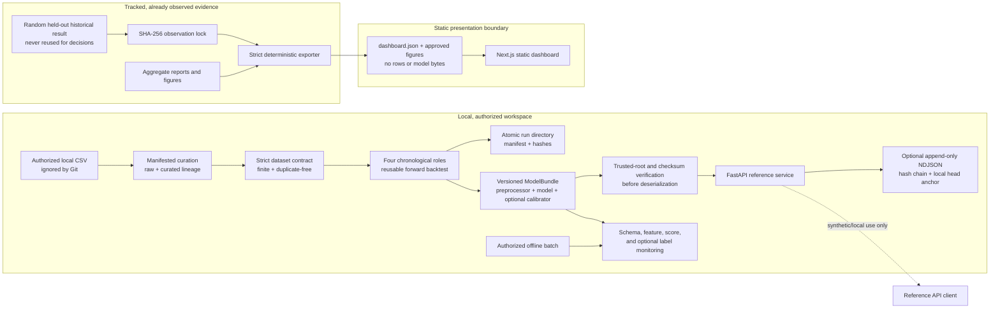
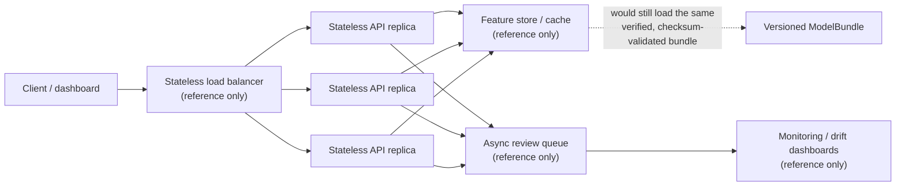

# Architecture and data flow

SecureSwipe is a portfolio reference with four deliberately separate paths:
offline model development, immutable historical evidence, verified local
serving, and a static public dashboard. It is not a bank authorization system.

## Component ownership

| Concern | Canonical implementation | Evidence/failure boundary |
|---|---|---|
| Dataset curation and lineage | `src/data/curation.py` and `scripts/curate_dataset.py` | Conflicting labels fail; stable exact-duplicate removal records raw/curated fingerprints and decision eligibility |
| Dataset schema and fingerprint | `src/data/data_loader.py` | Rejects wrong order/type, missing/non-finite values, negative Time/Amount, invalid Class, and unresolved exact duplicates |
| Split isolation | `src/data/split_data.py` | Pairwise row-hash intersections must be empty |
| Feature preprocessing | `src/preprocessing/preprocessors.py` | Fits scaling only on training rows and preserves the canonical 30-feature order |
| New scientific decisions | `scripts/run_development_training.py` and `scripts/run_development_analysis.py` | Operator-attested exact source; four content-hash-isolated roles; atomic bundle and verified reusable forward backtest |
| Historical observation | `src/evaluation/historical_lock.py` | Verify-only three-file SHA-256 lock; no evaluation execution path |
| Artifact persistence | `src/artifacts/bundle.py` | Trusted local root, complete manifest, sizes, hashes, runtime/dependency/schema/type checks before load |
| Batch scoring | `src/inference/batch_scoring.py` | One ordered, finite scoring path shared by serving and monitoring |
| HTTP interface | `api/` | Versioned schemas, bounded body/batch, stable errors, readiness, redacted logs, bounded metrics |
| Audit/idempotency | `api/audit.py` | In-process duplicate replay; canonical redacted NDJSON; hash chain plus local count/head anchor; tamper-evident, not immutable |
| Offline monitoring | `src/monitoring/` and `scripts/run_offline_monitoring.py` | Invalid batches are reported but never scored; drift triggers investigation, not automatic action |
| Public export | `scripts/export_web_data.py` | Cross-artifact invariants and read-only `--check`; no private/model input |
| Browser presentation | `web/` | Static-only by default; browser test fails on `/v1/predict` traffic |

## Evidence namespaces

The names are part of the scientific control, not presentation labels:

- `historical_reported_test` is the one already-observed random holdout. Its
  confusion-derived values are internally consistent, but the original score
  vector/runtime is absent and duplicate contamination cannot be measured.
- `new_authorized_four_role_reusable_backtest` packages a model trained on the
  first chronological role, calibration fit/selection evidence, and a reusable
  forward development diagnostic; content fingerprints enforce isolation.
- forward/blocked development evidence estimates temporal sensitivity by keeping
  equal timestamps together and refitting inside each fold.
- `legacy_random_*_reference` exists only to reproduce the old stage structure;
  it is explicitly ineligible for new decisions.

## Artifact and API trust boundary

Joblib/pickle integrity checks do not make arbitrary serialized objects safe.
The service accepts neither artifact uploads nor paths from requests. An operator
selects a locally produced manifest inside the configured artifact root. Bundle
bytes, schema, payload types, dependency/runtime versions, and checksums are
validated before deserialization. A missing bundle leaves liveness available but
readiness and inference unavailable; an explicitly configured invalid bundle
aborts startup.

Inference endpoints offload synchronous model work from the event loop, while a
lock serializes estimator access because arbitrary fitted estimators are not
assumed thread-safe. Request logs contain request metadata and model version, not
feature vectors or downstream exception messages.

When configured, successful inference also passes through the separate audit
boundary. Canonical input is hashed in memory; only its digest reaches the
append-only NDJSON event. The event binds the decision to the verified serialized
model-artifact fingerprint, and a verifier checks canonical encoding, every
previous/event hash, and a local count/head anchor. The anchor shares the log's
trust domain, so this is tamper-evident evidence rather than immutable storage.
Idempotent replay is coordinated in process and does not claim cross-replica or
post-restart durability.

## Deployment shape

The checked-in deployable units are a static Next.js frontend and a separately
containerized FastAPI service. The image contains no data, model, reports,
notebooks, frontend, tests, or credentials; a reviewed bundle is mounted
read-only. There is no verified public backend or repository-recorded frontend
URL. Provider selection, authentication, TLS/rate-limit ownership, public
deployment, and DNS remain external decisions requiring explicit approval.

See [THREAT_MODEL.md](THREAT_MODEL.md), [CONTAINER.md](CONTAINER.md), and
[OPERATIONS.md](OPERATIONS.md) for security and recovery boundaries.

## Reference: a horizontally scalable shape (not implemented)

Everything above this section describes what is actually built and checked
in. This section is different in kind: it is a **compact reference sketch**
of how the genuine-inference path (`api/`) could be scaled if it were ever
operated as a real service. Nothing described here exists in this
repository today. It is documentation only, not a roadmap commitment, not a
claim of production readiness, and not a Razorpay-scale or Razorpay-economics
statement.

What would need to change, none of which exists today:

- **Replica coordination.** The current `api/` process holds an in-memory
  idempotency registry and can append to one local audit sink. Horizontal
  replication would require a durable shared idempotency/result boundary and a
  single ordered audit stream (or independently anchored per-replica streams),
  in addition to a process supervisor, load balancer, and shared read-only
  bundle mount. *Not implemented.*
- **Feature store / cache.** A shared cache would only matter once
  request-time features are looked up rather than supplied in the request
  body, which is not how the current `/v1/predict` contract works. *Not
  implemented; no cache exists.*
- **Queue-backed review workflow.** The current review-threshold decision is
  synchronous and stateless. A durable queue would only become relevant if
  human review moved out of process. *Not implemented; no queue exists.*
- **Monitoring/drift at scale.** `src/monitoring/` already performs offline,
  batch schema/feature/score/label checks (see the table above); running the
  same checks continuously against a live replica fleet is a reference idea
  only. *Not implemented as a live service.*

Benchmark language, if this shape were ever exercised, should always be
reported with its environment attached (hardware, concurrency, single-node
vs. reference cluster) rather than as a bare RPS or latency number, and
should never be described as Razorpay-scale evidence — it would describe this
portfolio project's own reference API only.

This section intentionally does not describe the synthetic plumbing-test
simulator (`web/components/SyntheticPlumbingSimulator.tsx`): that simulator
is a fully in-browser, single-process demo with no server component, and it
is out of scope for a server-scaling discussion by construction.

## Current system shape (MT3–MT7)

Six parts, deliberately separate. A reviewer should never have to infer which one
produced a number.

| # | Part | What it is | Evidence category |
| --- | --- | --- | --- |
| 1 | **Public static dashboard** (`web/`) | Next.js evidence site. Ships aggregate numbers and disclosures only — runs no model, calls no API. | mixed; every panel is labelled |
| 2 | **Local FastAPI serving path** (`api/`) | Provenance-verified service you run yourself. Loads a byte-verified **historical reference demo bundle**, admission-gated, audit-chained, fails closed. | `HISTORICAL SERVING — LOOPBACK / NOT COMPARABLE TO MT3` |
| 3 | **Sealed offline Lane A evaluation** | The scientific result. Run **exactly once** on a programmatically held-out IEEE-CIS role under a pre-hashed protocol. Entirely offline; never served. | `SEALED FINAL EVALUATION — LANE A / IEEE-CIS` |
| 4 | **Human-review capacity & cost decision aid** (`web/lib/laneACostModel.ts`) | Client-side arithmetic over the sealed aggregate counts. Selects no capacity and no threshold. | `ILLUSTRATIVE COST SCENARIO — NOT RAZORPAY ECONOMICS` |
| 5 | **Local SQLite durability prototype** (`src/operations/durable_idempotency.py`) | Optional, **non-default** idempotency backend. The in-memory registry remains the default and `api/` is unchanged. | `LOCAL SQLITE DURABILITY PROTOTYPE — OPTIONAL / NON-DEFAULT` |
| 6 | **Synthetic order-integrity reference** (`src/order_integrity/`) | Pre-model input-contract guardrail. Never wired into `/v1/predict`, never part of ML metrics. | `SYNTHETIC ORDER-INTEGRITY REFERENCE — SEPARATE FROM FRAUD MODEL` |

**The sealed model (3) is not the served model (2).** The serving path
deliberately runs a historical demo bundle, so no serving measurement says
anything about the sealed evaluation's quality, and no sealed metric says
anything about serving behaviour.

Parts 5 and 6 sit outside the request path entirely. Neither is enabled by
default, and neither contributes to any fraud metric.

The horizontally scalable shape described above remains **reference only, not
implemented**. Multi-worker serving is incompatible with current state ownership
because idempotency, admission, and audit state are process-local.
