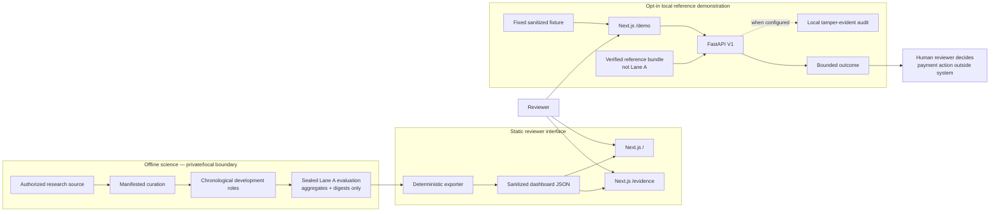
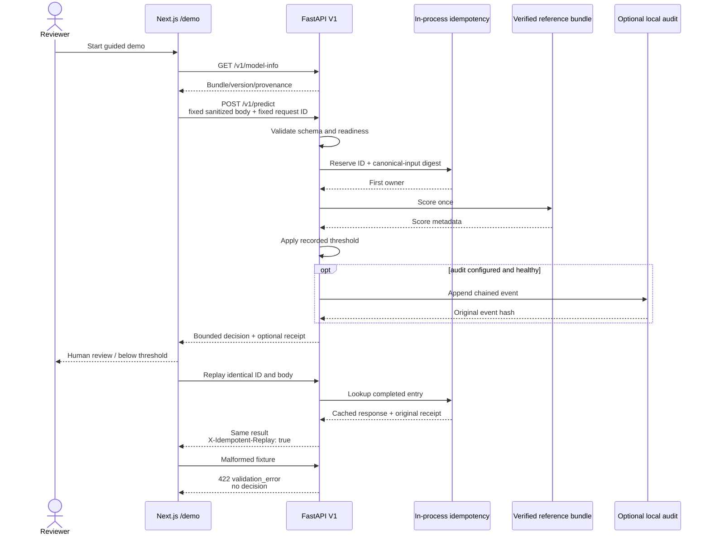
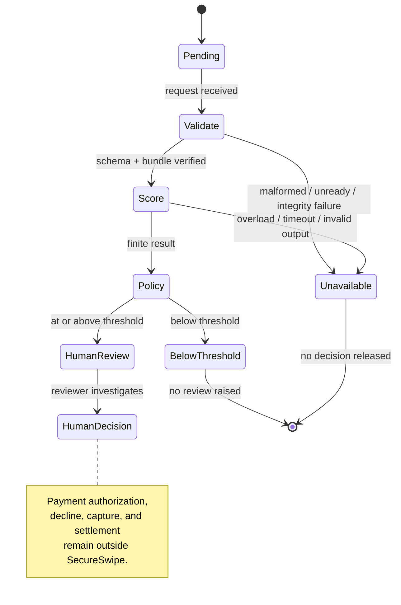
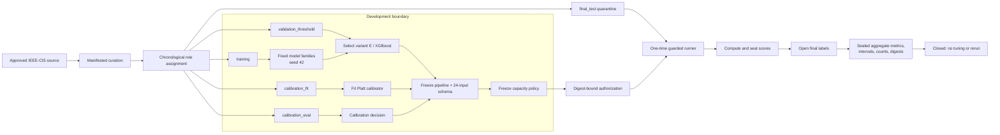
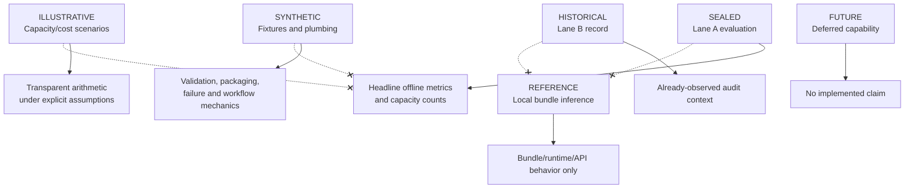
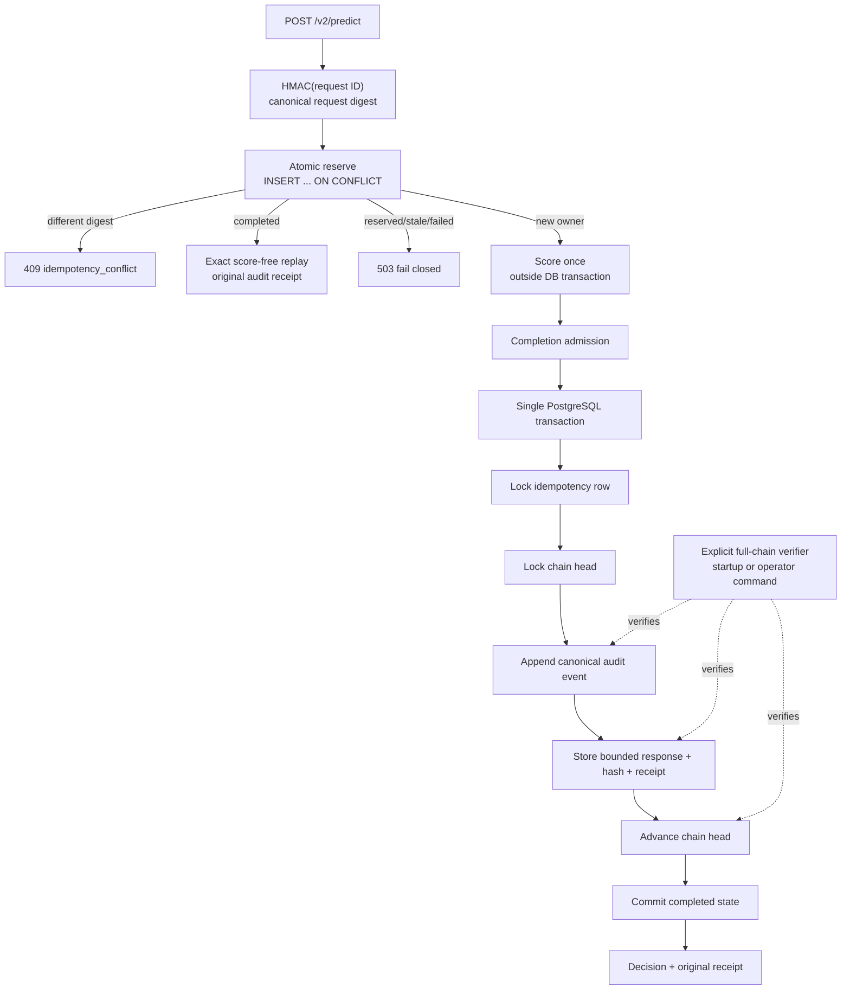
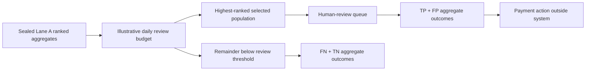

# SecureSwipe diagram blueprint — draft Mermaid specifications

These are implementation drafts from the local working-tree architecture audit.
They are diagrams of verified boundaries, not claims of production deployment,
Razorpay integration, autonomous payment action, or benchmark-proven scale.

## 1. SecureSwipe: three paths, explicit evidence boundaries

Required adjacent disclosure: the local demo does not serve the sealed Lane A
model; `/` and `/evidence` do not require a backend.

## 2. Deterministic local request and replay sequence

Required adjacent disclosure: replay is same-process behavior for V1; audit
confirmation is unavailable when the API did not return a readable receipt.

## 3. Bounded decision and fail-closed state machine

Required adjacent disclosure: “below review threshold” does not mean approved,
safe, legitimate, or non-fraudulent.

## 4. Lane A leakage-controlled evaluation lifecycle

Required adjacent disclosure: final_test was programmatically held out, not
human-blind or externally blind. The final output is offline evaluation evidence,
not API-serving evidence.

## 5. Claim-to-evidence firewall

The crossed edges must be labelled “no claim inheritance” in an SVG or HTML
version because Mermaid renderer support for cross-edge styling varies.

## 6. PostgreSQL V2 idempotency and transactional audit

Required adjacent disclosure: this is an opt-in, local PostgreSQL correctness
profile. It stores score-free bounded responses; the P1-S4 matrix did not
authorize a scalability, capacity, or production claim.

## 7. Review capacity: the two-sided operational trade-off

Use this accompanying accessible table or SVG chart; do not imply a recommended
capacity or observed merchant economics.

| Illustrative reviews/day | Recall | Legitimate transactions sent to review |
| ---: | ---: | ---: |
| 100 | 27.18% | 2,239 |
| 250 | 45.70% | 6,285 |
| 500 | 64.39% | 13,404 |
| 1,000 | 80.18% | 28,306 |
| 2,000 | 93.84% | 58,663 |

Required adjacent disclosure: these are sealed IEEE-CIS aggregate results and
illustrative capacity tiers. They are not staffing defaults, Razorpay economics,
or a production operating recommendation.

## Source references

- `docs/ARCHITECTURE.md`
- `docs/EVIDENCE_GUIDE.md`
- `docs/MODEL_CARD.md`
- `docs/API.md`
- `docs/LIMITATIONS.md`
- `docs/evidence/LANE_A_FINAL_EVALUATION.md`
- `docs/evidence/LANE_A_FINAL_EVALUATION_PROTOCOL.md`
- `docs/evidence/CLAIM_TO_EVIDENCE_MATRIX.md`
- `docs/benchmarks/P1_S4_TERMINAL_CLOSEOUT_EVIDENCE.md`
- `api/main.py`, `api/audit.py`, `api/postgres_idempotency.py`, and `api/postgres_audit.py`
- `src/lane_a/capacity.py` and `scripts/lane_a_run_final_evaluation.py`
