# Baseline audit

Audit target: commit `09da37b05d005ab232912d88d94e586209b5a34a`

## System map

```mermaid
flowchart LR
    A["Local Kaggle creditcard.csv"] --> B["Schema summary"]
    B --> C["70/15/15 row-random stratified split"]
    C --> D["Fit scaler on training Time/Amount"]
    D --> E["Processed parquet splits"]
    E --> F["Dummy / Logistic / Random Forest / XGBoost"]
    F --> G["Single validation model comparison"]
    G --> H["Validation threshold sweep"]
    H --> I["One recorded random held-out test evaluation"]
    G --> J["Validation-sample SHAP"]
    I --> K["Tracked reports and figures"]
    J --> K
    K --> L["Exported dashboard.json + figures"]
    L --> M["Static Next.js dashboard"]
```

The current hosted architecture is static and honestly says that it does not
perform live inference. The Python API, serving pipeline, cost analysis,
Streamlit app, and root Dockerfile are placeholders. Model and preprocessor
objects were historically stored separately and are not present in this clone.

## Scientific validity

### Historical result status

Git history supports this sequence: Day 5 model selection (`e142efa`), Day 6
threshold selection (`bbf4d49`), and Day 7/final evaluation (`fc47df4`). No
committed later model/threshold decision was found. The test result has now been
observed and must remain historical evidence, never a development target.

The following confusion-matrix metrics were independently recomputed from the
committed counts (TP 62, FP 27, FN 12, TN 42,621; 42,722 rows, 74 frauds):

| Metric | Recomputed value |
|---|---:|
| Precision | 0.6966292135 |
| Recall | 0.8378378378 |
| F1 | 0.7607361963 |
| Specificity | 0.9993669105 |
| False-positive rate | 0.0006330895 |
| False-negative rate | 0.1621621622 |

Those values match the JSON. Historical AP `0.828784854` and ROC-AUC
`0.961343202` cannot be recalculated from committed material because score
vectors, the exact dataset/split, fitted artifact, dependency set, and run
manifest are absent.

### Invalid or unsupported claims (P0)

- The EDA records 1,081 exact duplicate rows, while schema validation merely
  summarizes duplicates and the split uses independent row-level random draws.
  Cross-split identical rows were not prevented or measured.
- A random historical holdout—especially one with possible duplicate leakage—
  cannot support “honest, unbiased estimate of real-world/production
  performance.”
- “Blocked,” “approved,” and “acceptable false alerts” imply an authorization
  policy and economic decision that this reference project does not have.

### Major scientific gaps (P1)

- No chronological/blocked backtest despite the `Time` field.
- XGBoost validation AP `0.8129` versus Random Forest `0.8125` is not a
  demonstrated superiority; only 74 validation frauds and no paired uncertainty
  analysis were used.
- Threshold `0.53` is a point estimate chosen for observed recall >= 0.80, not a
  business-cost optimum. Approximate Wilson 95% intervals are 0.707–0.884 for
  recall and 0.525–0.715 for precision on validation.
- No Brier score, reliability curve, calibration error, or leakage-safe
  calibrator comparison. Class-weighted XGBoost output must be called a raw
  score until calibration is demonstrated.
- `pr_auc` is implemented with `average_precision_score`; public naming should
  use average precision unless literal curve integration is also computed.
- SHAP non-causality/PCA caveats are good, but output units and sample cohort
  composition are not verified.
- Protected-group fairness cannot be evaluated because protected attributes are
  absent from the anonymized PCA dataset.

## Reproducibility and lineage

- Python dependencies were unbounded and mixed training, notebook, frontend
  demo, API, and runtime concerns.
- Configuration contradicts active paths and thresholds.
- Split metadata has counts/timestamp but no dataset fingerprint, row hashes,
  code SHA, seed manifest, or artifact hashes.
- Separate joblib objects are not bound into a complete model/preprocessor/schema
  unit.
- Several report generators embed threshold/validation constants rather than
  deriving content from supplied artifacts.

## Backend and serving

- `api/main.py`, `api/service.py`, `api/schemas.py`, `src/inference/*`, and
  `src/models/predict.py` are placeholders.
- There is no startup verification, feature parity, request validation, stable
  error contract, concurrency behavior, request limit, CORS policy, OpenAPI
  contract test, or unavailable-model behavior.
- Live inference cannot be supported honestly until a verified complete bundle
  exists. The API must remain unready when no bundle is configured.

## Security and privacy

- P0: multiple bare `joblib.load` calls accept local paths without checksum,
  provenance, dependency compatibility, trusted-root, or type checks.
- No raw dataset, model, tracked local environment file, private key, or obvious
  token signature was found in the current tree or limited history scan.
- `.env*`, data, models, artifacts, and frontend local outputs are mostly ignored;
  Kaggle credential filenames are a preventive gap.
- The static frontend exposes no `NEXT_PUBLIC_*` secret and no transaction upload
  path. Existing security headers are a useful baseline.
- There is no API threat model, body/batch limit, CORS allowlist, structured
  redacted logging, dependency audit automation, or secret scanner.

## Operations and supply chain

- Dockerfile is comments only; `.dockerignore` is absent.
- Docker cannot be tested until the local daemon runs.
- `.github/` is absent: no CI, Dependabot, PR template, artifact gate, code scan,
  container build/scan, or release workflow.
- No health/readiness endpoints, bounded metrics, offline drift monitor,
  measured SLOs, deployment runbook, incident guide, or rollback procedure.
- The tracked project audit checks path existence and accepts zero-byte files;
  it is not a quality gate and currently claims an absent artifact passed.

## Frontend and QA

Positive baseline: static/live distinction is clear, SHAP is noncausal, lint,
typecheck, production build, export check, and npm audits pass.

Gaps:

- `npm test` is only lint plus typecheck; no component, accessibility, keyboard,
  responsive, or browser tests.
- Export `--check` can overwrite figures and its digest excludes public images.
- Cross-artifact metric and threshold invariants are incomplete.
- Build/deploy does not require the export verification gate.
- Mobile section navigation, skip link, progress semantics, table captions/header
  scope, and nonvisual chart descriptions need improvement.
- Placeholder/duplicate modules and stale final documents make the canonical
  architecture harder to defend.

## Priority conclusion

The highest-risk coherent order is:

1. dataset integrity and historical-claim correction;
2. verified artifact boundary and complete bundle;
3. strict tested API and parity;
4. reproducible dependency/runtime packaging;
5. container and operational controls;
6. scientific development protocol, calibration/cost analysis, monitoring;
7. frontend live-demo fallback, supply-chain automation, and full documentation.

